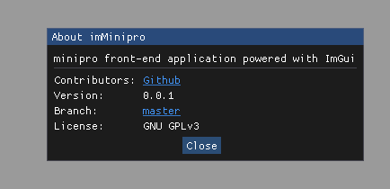
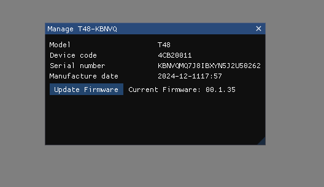

Desktop application to interface with the XGecu series of chip programmers.
Uses ImGui library with the SDL3/OpenGL3 backend.
Uses the [minipro](https://gitlab.com/DavidGriffith/minipro) tool as a library.

# Current Features
 - Detect programmer

# Planned Features
 - Built-in hex editor for quick viewing and editing
 - Create custom chips

# Build
```
git clone https://github.com/jkvince/imMinipro --recurse-submodules
cmake -S .
```

# Images

